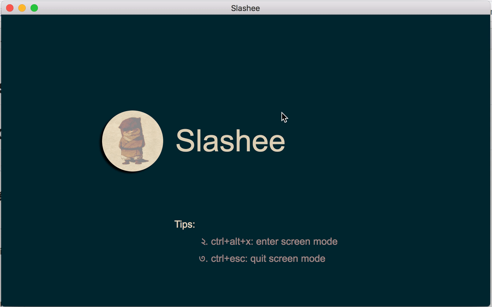

# Slash 🐿
# electron 的一个截图插件工具

思路来源于[chong0808](https://github.com/chong0808/shotScreen)，我对其进行了一定美化与改造

### 测试案例
#### 下载之后 
#####  $ npm i electron -g
#### 启动 
#####  $ npm run dev 

#### 使用截图



### 文件结构
```
├── screen  // 插件主要文件
│   ├── mainProcess
│   │   └── index.js  // 主进程引入的文件 主要是俩个渲染进程中相互通信的桥梁
│   └── renderProcess // 渲染进程引入的文件
│       ├── asset  // 资源文件
│       ├── index.html // 创建截图渲染进程的文件
│       ├── index.js //  与外界交互的操作
│       └── main-process.js //  创建截图渲染进程中 对图片剪切操作的文件 主要就是canvas的操作
├── test  // 示例文件
│   ├── index.html 
│   └── main.js
├── README.md
└── package.json
```

### 使用方式
####  下载文件之后 主进程中引入 文件 
```
 var screenShot = require('./screen/mainProcess');
 //主进程执行完毕之后 然后执行并传入win 实例及配置
 app.on('ready', () => {
    var url = '/index.html';
    win = createWindow(url);
    win.webContents.openDevTools();
    screenShot(win.webContents,{quit:'ctrl+esc',shotKey:'ctrl+alt+x'});
})
```
##### quit:退出快捷键   shotKey：截图快捷键
#### 渲染进程使用方式示例
```
<!DOCTYPE html>
<html lang="en">

<head>
    <meta charset="UTF-8">
    <meta name="viewport" content="width=device-width, initial-scale=1.0">
    <meta http-equiv="X-UA-Compatible" content="ie=edge">
    <title>Document</title>
    <style>
        .box {
            width: 500px;
            height: 200px;
            margin: 0 auto;
        }
        
        .box button {
            width: 100px;
            height: 30px;
            margin: 50px;
        }
    </style>
</head>

<body>
    <div class="box">
        <button data-clipScreen='clipBtn'>截图</button> //在截图按钮中给与属性 data-clipScreen='clipBtn'；或者在指定按钮绑定screen()方法
        <button data-cancelclipScreen='clipBtn'>取消</button> //在截图按钮中给与属性 data-cancelclipScreen='clipBtn'；或者在指定按钮绑定screenShot()方法
    </div>
</body>
<script>
    var screen = require('./screen/renderProcess');  // 引入文件

</script>

</html>
```
#### 插件主进程文件
   渲染进程中我们也能使用主进程中的api，在这个文件中，主要的用途就是渲染进程之间的通讯桥梁

```
const { ipcMain, dialog,globalShortcut } = require('electron');
module.exports = function(winContent,obj) {
    // 接收截图工具信号
    ipcMain.on('screenshot-page', function(sender, message) {
        switch (message.type) {
            case 'close':
                winContent.send('quit-cut')
                break;
            default:
                break;
        }
    });
    // 退出快捷键
    var quitShot = (obj&& obj.quit) || 'ctrl+esc';
    var shotKey = (obj&& obj.shotKey) || 'ctrl+alt+x';

    globalShortcut.register(quitShot, function() {
        winContent.send('quit-cut', 1);
    });
    // 截图快捷键
    globalShortcut.register('ctrl+alt+d', function() {
        winContent.send('global-shortcut-capture', 1);
    });
};
```

#### 外部渲染进程引入的index.js

##### 1. 截图按钮与取消绑定方法
```
// 点击事件绑定
document.body.addEventListener('click', function(event) {
    if (event.target.dataset.clipscreen) {
        screenShot ();
        return false;
    }
})

// 去除默认选择
document.onselectstart = function() {
    return false;
}
// 点击事件方法
function screenShot(){
    if (!win) {
        capturer().then(function(data) {
            win = createChildWin('/index.html', { fullscreen: true, alwaysOnTop: true, skipTaskbar: false, autoHideMenuBar: true, });
            // win.webContents.openDevTools()
        });
    }
    return win;
} 
```
##### 2.在点击之后 对屏幕进行截屏  
 
```
/**
 * 截取屏幕资源到本地
 */
function capturer() {
    return new Promise(function(resolve, reject) {
        desktopCapturer.getSources({ types: ['window', 'screen'], thumbnailSize: { width: w, height: h } }, (error, sources) => {
            if (error) console.error(error);
            localStorage['image'] = sources[0].thumbnail.toDataURL();
            resolve(sources[0].thumbnail.toDataURL())
        })
    })
}
```
##### 3.创建渲染进程。
a.创建一个无边框全屏的渲染进程
```
var opts = { 
    fullscreen: true, 
    alwaysOnTop: true, 
    skipTaskbar: false, 
    autoHideMenuBar: true 
}
/**
 * 创建截屏窗口
 */
function createChildWin(_url, opts) {
    var config = {
        fullscreen: true,
        frame: false
    }
    config = Object.assign(config, opts)
    var _win = new BrowserWindow(config);
    _win.loadURL(url.format({
        pathname: path.join(__dirname + _url),
        protocol: 'file',
        slashes: true
    }))

    _win.on('closed', () => {
        _win = null;
    })
    _win.on('close', () => {
        _win = null;
    })
    return _win;
}

```

b.将第二步骤中截取的屏幕资源 加载到该渲染进程中的canvas中
剩下的都是canvas截图的操作
```
/*
 *
 *原理运用遮罩层，俩个canvas，底下为背景原图产生一个黑色背景画布，上层选区，将选中像素绘制到选区
 *鼠标按下移动鼠标产生一个矩形框，
 *
 */
 // 创建一个类
 class Screen {
    constructor(cas, casMask, src) {
        this.canvas = document.getElementById(cas);
        this.canvasMask = document.getElementById(casMask);

        this.context = this.canvas.getContext("2d");
        this.contextMask = this.canvasMask.getContext("2d");

        this.width = screen.width;
        this.height = screen.height;
        this.canvas.width = this.width;
        this.canvas.height = this.height;
        
        this.image = new Image();
        this.image.src = src;

        this.cuted = false;
        this.isShowTool = false;

        this.tool = document.querySelectorAll('.tool')[0];
        this.tip = document.querySelectorAll('.tipNum')[0];

        this.leftTopCursor = document.querySelectorAll('.left_top')[0];
        this.rightTopCursor = document.querySelectorAll('.right_top')[0];
        this.leftBottomCursor = document.querySelectorAll('.left_bottom')[0];
        this.rightBottomCursor = document.querySelectorAll('.right_bottom')[0];
        // 原本是将屏幕截图image画到this.context画布上的 
        //  不知道为何画出来的是空白的
        // 取而代之的方式是全屏一张图片
        document.getElementsByTagName('body')[0].appendChild(this.image);
        // this.drawImg(this.image); 
        this.createMask();
        this.getMouse();
        // 绑定this到原型链上
        this.drawImg = this.drawImg.bind(this)
        this.getMouse = this.getMouse.bind(this)
        this.clearCtx = this.clearCtx.bind(this)
        this.createRect = this.createRect.bind(this)
        this.createMask = this.createMask.bind(this)
        this.createReatImage = this.createReatImage.bind(this)
        this.tipShow = this.tipShow.bind(this)
        this.showTool = this.showTool.bind(this)
        this.hideTool = this.hideTool.bind(this)
        this.close = this.close.bind(this)
        this.sendMsg = this.sendMsg.bind(this)
        this.RGBA2ImageData = this.RGBA2ImageData.bind(this)
        this.dragEvent = this.dragEvent.bind(this)
    }
```

 

